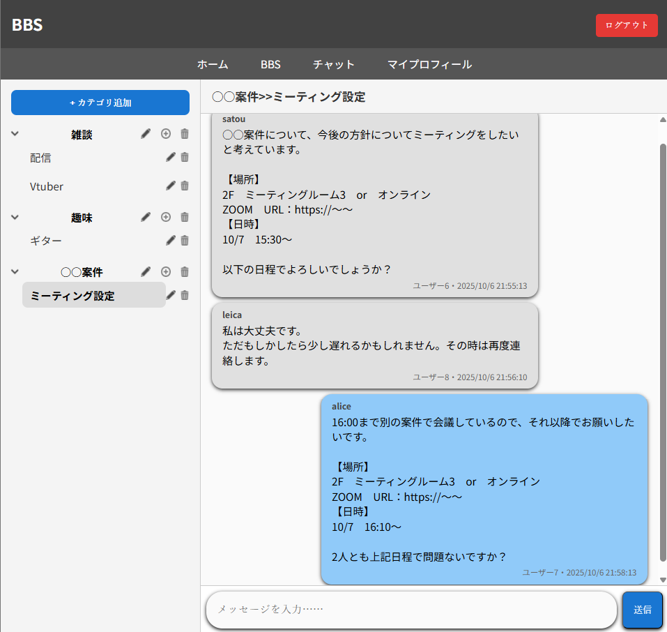
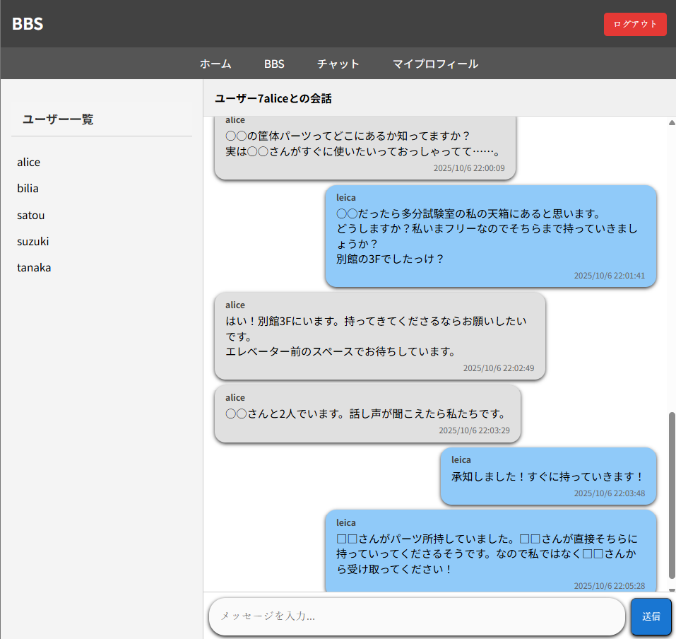

# MyBBS App

シンプルな掲示板 & チャットアプリです。
※AI（ChatGPTなど）を活用して設計・開発しました 
**Node.js + Express + MySQL (MariaDB)** を使用して実装しました。  
フロントはバニラ JavaScript で構築しています。

---

## 📌 主な機能
- 掲示板機能  
  - カテゴリの作成 / 削除 / リネーム  
  - スレッドの作成 / 削除 / リネーム  
  - メッセージ投稿（吹き出し UI）  
- チャット機能（ダイレクトメッセージ）  
- ユーザープロフィール編集（ID / ユーザー名 / メール / パスワード）  

---

## 🛠️ 使用技術
- **バックエンド**: Node.js, Express  
- **フロントエンド**: HTML, CSS, Vanilla JavaScript  
- **データベース**: MySQL (MariaDB)  
- **開発環境**: phpMyAdmin / XAMPP  

---

## 🚀 セットアップ手順

1. Node.js (v18+) と MySQL を準備  
2. このリポジトリを clone  
   ```bash
   git clone https://github.com/username/mybbs-app.git
   cd mybbs-app
   ```
3. 依存パッケージをインストール
   ```bash
   npm install
   ```
4. `mybbs_app.sql` を DB にインポート

   ```bash
   mysql -u root -p mybbs_app < mybbs_app.sql
   ```
5. `server/db.js` 内の接続情報を自分の環境に合わせて修正
6. サーバー起動

開発時（ホットリロード有り）:
```bash
npx nodemon ./server/index.js

   ```
本番想定（通常起動）:
node server/index.js

7. ブラウザで [http://localhost:3000](http://localhost:3000) にアクセス

---

## 📂 ディレクトリ構成

```
public/             # フロントエンド
├─ index.html
├─ main.js
├─ ui.js
├─ events.js
├─ style.css
└─ assets (plus.png / garbage.png など)
server/
├─ index.js         # サーバーエントリーポイント
└─ db.js            # DB 接続
mybbs_app.sql       # DB スキーマ (空)
README.md
```

---

## ⚠️ 注意事項

* DB 初期化用 SQL はテーブル定義のみ含まれます（データは空）。
* 学習用のサンプル実装です。**パスワードのハッシュ化やCSRF/XSS対策は未実装** のため、本番環境での利用は推奨しません。

## 📸 スクリーンショット

### 掲示板画面
カテゴリ・スレッド一覧と、吹き出し形式のメッセージ投稿  
自分の投稿は水色で表示されます。



### チャット画面
ユーザー一覧と、ダイレクトメッセージの会話画面  
相手の投稿はグレー、自分の投稿は水色で表示されます。



---

## 🪄 ライセンス

MIT License
© 2025 AtsushiFukuhara-PGM

---


